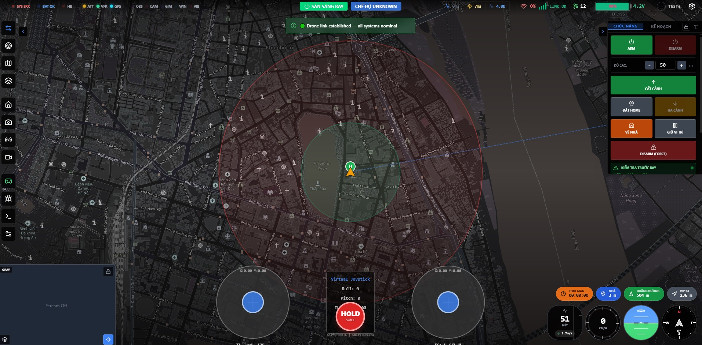

# UAVLink-Edge (Python Version for Pi 5)

[Tiếng Việt](#tiếng-việt) | [English](#english)

---

## English

Dự án này là phiên bản viết bằng Python của UAVLink-Edge. Vai trò cốt lõi của ứng dụng là làm cầu nối (bridge) giữa mạch điều khiển bay (Flight Controller) thông qua giao thức MAVLink và hệ thống máy chủ **qcloudstation** tại địa chỉ [http://qcloudcontrol.com/](http://qcloudcontrol.com/).

This project is the Python implementation of UAVLink-Edge. The core role of this application is to act as a bridge between the Flight Controller (via MAVLink protocol) and the **qcloudstation** server at [http://qcloudcontrol.com/](http://qcloudcontrol.com/).

Hệ thống cho phép người dùng giám sát và điều khiển phương tiện không người lái (UAV) gần như theo thời gian thực (near real-time) qua nền tảng đám mây (Cloud), mang đến trải nghiệm lưu loát và khả năng điều khiển từ xa tương tự như phần mềm QGroundControl truyền thống.

The system allows users to monitor and control Unmanned Aerial Vehicles (UAVs) in near real-time via the Cloud, providing a smooth experience and remote control capabilities similar to traditional QGroundControl software.



### System Block Diagram / Sơ đồ khối hệ thống

```text
┌────────────────┐      MAVLink      ┌──────────────────────┐   UDP/TCP (WiFi)   ┌───────────────────────────┐
│ Flight         │◄─────────────────►│     UAVLink-Edge     │◄──────────────────►│   qcloudstation Server    │
│ Controller     │ (Serial/TCP/UDP)  │  (Raspberry Pi 5)    │                    │ (http://qcloudcontrol.com)│
└────────────────┘                   └──────────────────────┘                    └───────────────────────────┘
```

## 🚀 1. Architecture Overview / Tổng quan Kiến trúc

The Python version operates with 3 core components:
Phiên bản Python này hoạt động với 3 thành phần (module) cốt lõi:

1.  **Auth Client (`auth_client.py`)**: Handles the HMAC-SHA256 handshake over TCP to authenticate the drone with the server. It maintains the `SessionToken` and sends Heartbeat packets to keep the connection alive.
    (Đảm nhiệm quá trình bắt tay (handshake) bằng HMAC-SHA256 qua TCP để xác thực danh tính Drone với máy chủ. Nó duy trì `SessionToken` và gửi các gói tin Heartbeat để giữ kết nối.)
2.  **MAVLink Forwarder (`forwarder.py`)**: Listens and communicates with the flight controller (Pixhawk/Cube) via Serial (UART) or TCP/UDP. Received data is encapsulated and forwarded to the Fleet Server via UDP.
    (Lắng nghe và giao tiếp với mạch điều khiển bay (Pixhawk/Cube) thông qua cổng Serial (UART) hoặc TCP/UDP. Data nhận được sẽ được đóng gói và gửi lên Fleet Server qua giao thức UDP.)
3.  **Web Server (`web_server.py`)**: Runs a lightweight Web API (Flask) on port 8080 for real-time status monitoring (`/api/status`).
    (Chạy một web API siêu nhẹ (Flask) ở port 8080 để giám sát trạng thái (`/api/status`) theo thời gian thực.)

---

## 🛠️ 2. Environment & Deployment Guide / Hướng dẫn Triển khai

To run the system optimally without affecting OS Python libraries, we use a Virtual Environment (`venv`).
Để chạy hệ thống một cách tối ưu, chúng ta sẽ sử dụng Môi trường ảo (`venv`).

### Step 1: Prepare source and environment / Chuẩn bị mã nguồn
```bash
# Clone source code
git clone <YOUR_REPO_URL>
cd UAVLink-Edge-Python

# Create virtual environment / Tạo môi trường ảo
python3 -m venv venv

# Activate virtual environment / Kích hoạt môi trường ảo
source venv/bin/activate
```

### Step 2: Install Dependencies / Cài đặt thư viện
```bash
# Upgrade pip / Cập nhật pip
pip install --upgrade pip

# Install required libraries / Cài đặt thư viện
pip install -r requirements.txt
```
*Note: `pymavlink` is the most critical component for parsing and transmitting MAVLink packets.*
*(Ghi chú: Thư viện `pymavlink` là thành phần quan trọng nhất để xử lý gói tin MAVLink.)*

### Step 3: Configure `config.yaml` / Cấu hình
You need to adjust `config.yaml` to match your hardware on Pi 5.
Bạn cần cấu hình lại file `config.yaml` để phù hợp với phần cứng trên Pi 5.

```yaml
mavlink:
    connection_type: "serial"    # Or "tcp_client", "udp_listen"
    serial_port: "/dev/ttyAMA0"  # UART port on Pi 5
    serial_baud: 57600           # Serial baudrate
    
auth:
    uuid: "YOUR-DRONE-UUID"
    shared_secret: "YOUR-SHARED-SECRET" # Get from qcloudcontrol.com
```
*Note: Make sure you have the `.drone_secret` file in the same directory or parent directory if already registered.*
*To request a "SHARED-SECRET", please send an email to: hbqsolution@gmail.com*
*(Lưu ý: Để lấy "SECRET-KEY-DUNG-CHUNG", vui lòng gửi email request tới hbqsolution@gmail.com)*

### Step 4: Run Application / Chạy ứng dụng
```bash
# Direct run (for debugging) / Chạy trực tiếp để debug
python3 main.py

# Run in background / Chạy ẩn
nohup python3 main.py > uavlink.log 2>&1 &
```

Check system status / Kiểm tra trạng thái:
👉 `http://<PI_5_IP>:8080/api/status`

---

## 💻 3. Development Guide / Hướng dẫn Phát triển

### MAVLink Port & Routing (`forwarder.py`)
- All MAVLink logic is contained in the `Forwarder` class.
- To add internal logic (e.g., packet filtering, custom headers), modify `uplink_loop()` and `downlink_loop()`.
- `self.pixhawk_conn` holds the hardware connection. Use `self.pixhawk_conn.write(data)` for commands (ARM/DISARM, param changes).

### Web API Integration (`web_server.py`)
- For local drone features over WiFi (e.g., ESC Calib tool), modify `web_server.py`.
- Add endpoints using Flask:
  ```python
  @app.route('/api/custom_action', methods=['POST'])
  def custom_action():
      # Interaction code with Pixhawk here
      return jsonify({"success": True})
  ```

### Authentication Process / Quy trình Xác thực
The Python version follows the 4-step handshake:
1.  **Send UUID**: Drone connects to TCP (Port 5770) and sends `0x01` + UUID.
2.  **Receive Challenge**: Server returns `0x02` + `Nonce`.
3.  **Sign Signature**: Drone uses `SHA256(SecretKey + SharedSecret)` as the HMAC key to sign the `Nonce` + `Timestamp` (packet `0x03`).
4.  **Receive Token**: Server verifies and returns `0x04` + `SessionToken`. Subsequent UDP processes use this token for valid permission.

---

## Directory Structure / Cấu trúc thư mục

```
UAVLink-Edge-Python/
├── auth_client.py      # Secure HMAC authentication module
├── config.py           # YAML configuration parser
├── config.yaml         # Local configuration file
├── forwarder.py        # MAVLink Bridge using `pymavlink`
├── main.py             # Main entry point
├── README.md           # Documentation
├── requirements.txt    # PIP dependencies
└── web_server.py       # Mini API Framework (Flask)
```

---

## Tiếng Việt

(Nội dung tiếng Việt tương tự như trên đã được lồng ghép song ngữ)
